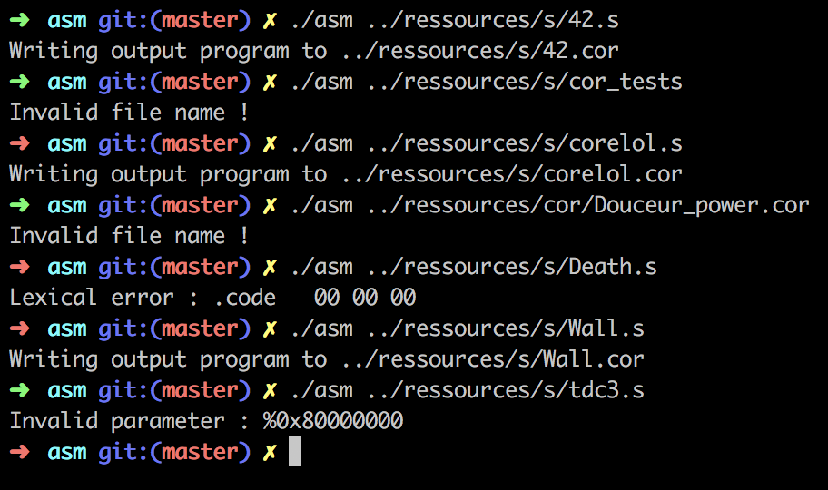
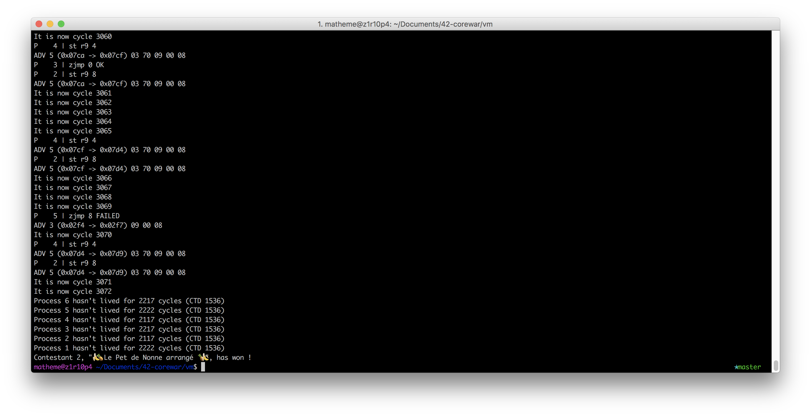
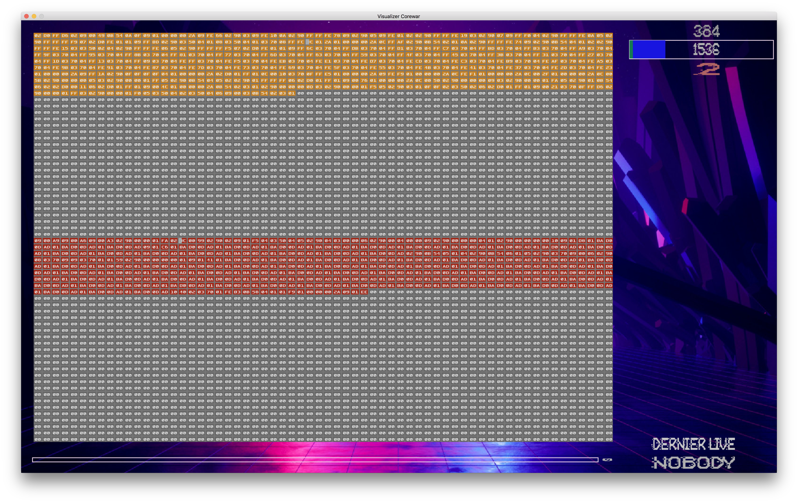
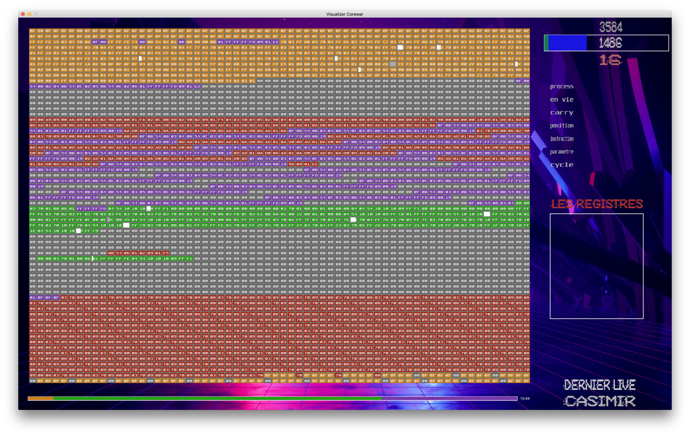
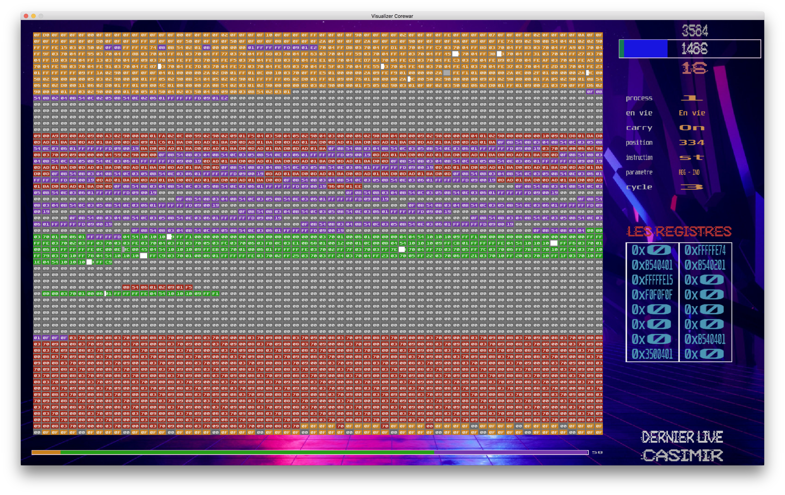
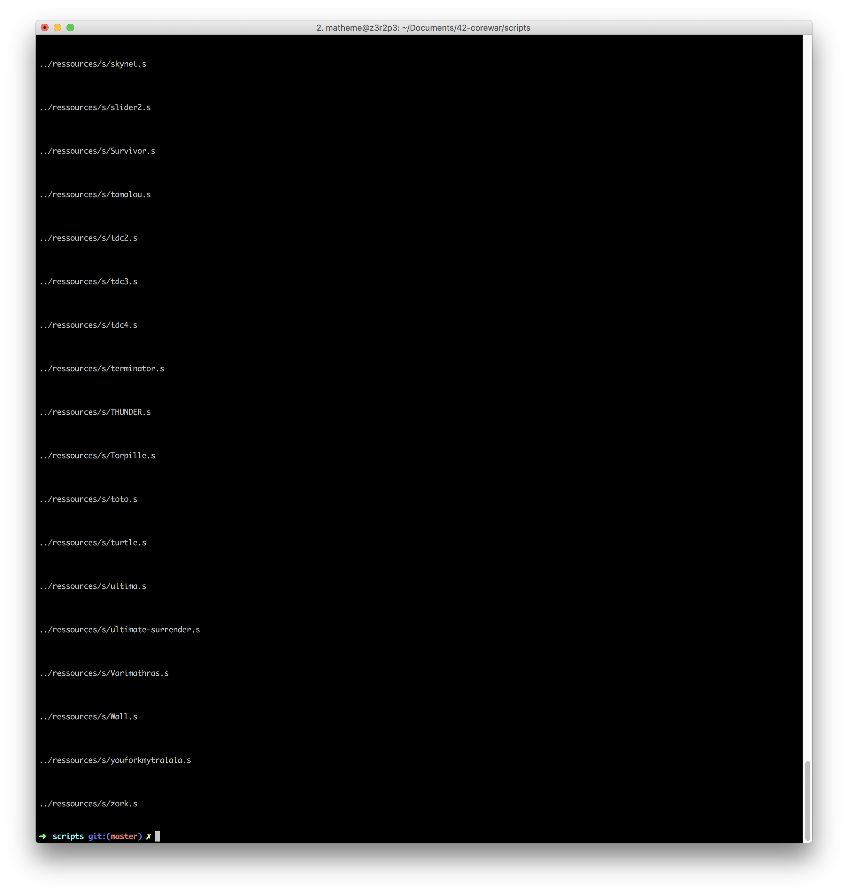
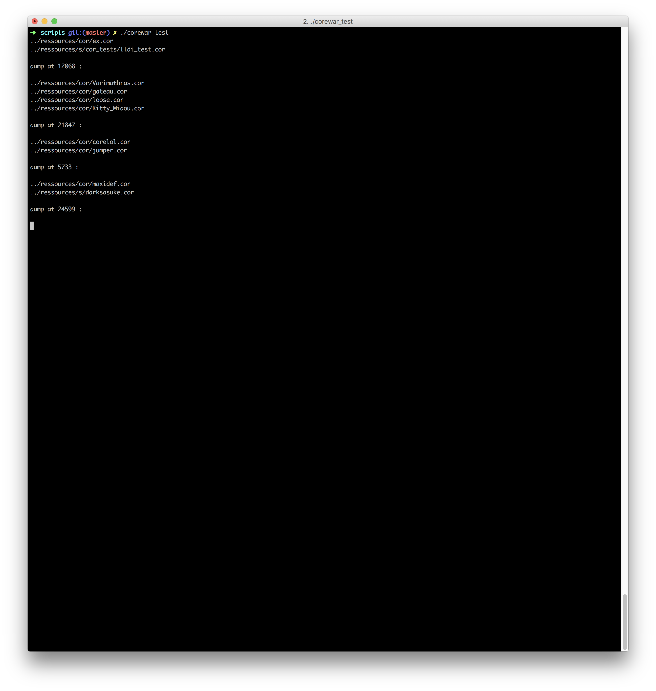
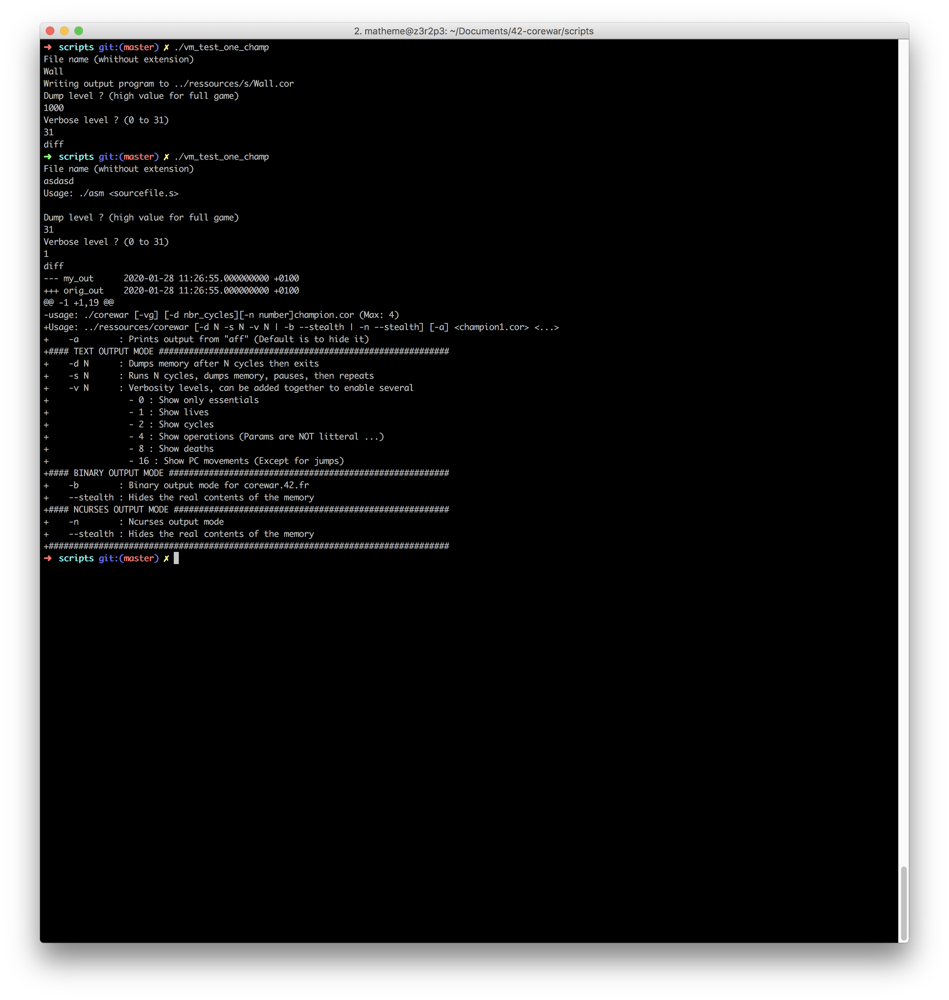
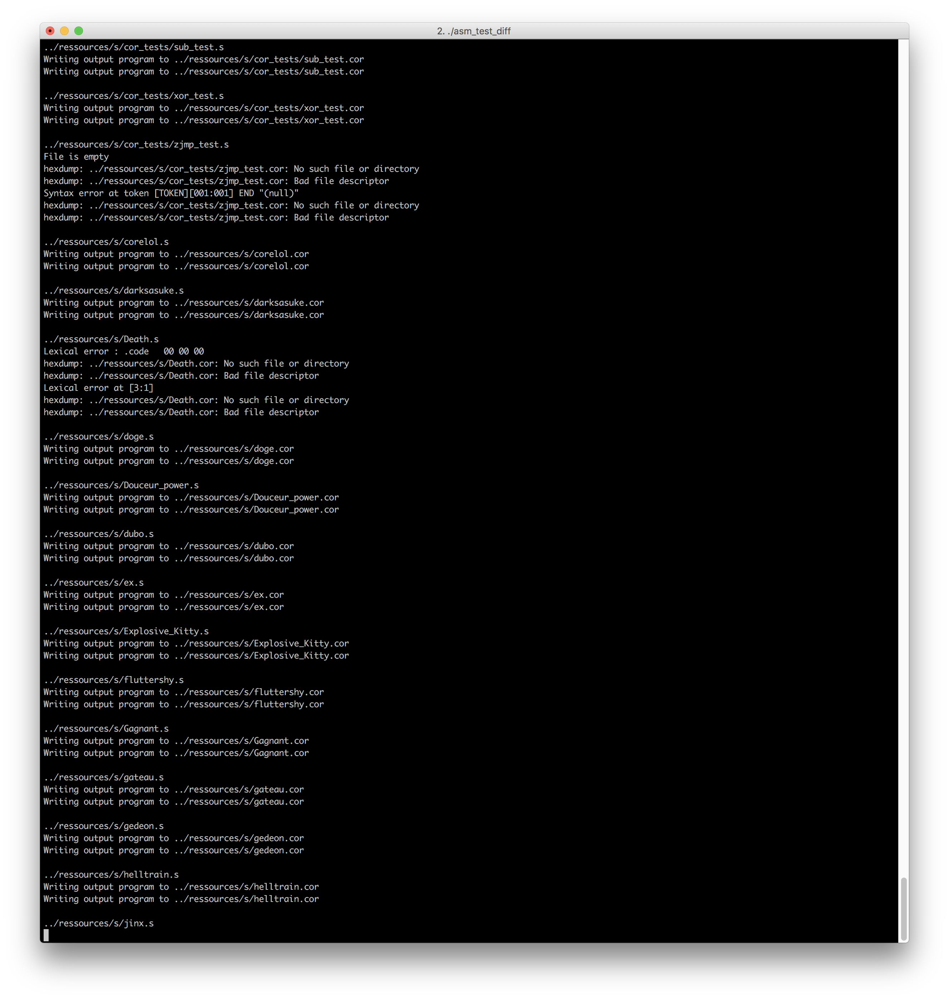

#42-Cursus
- corewar is the last project of the algo branch of the cursus 42
- corewar is a project between 3 or 4 student. I decided to make this project with kgrojea and ocrossi (2 students of 42 school)

# 42-corewar
This project involves creating a virtual arena, and having simplistic-language programs fight each other. You will thus get acquainted with VM conception (with instructions it recognizes, registers, etc) and compilation problems of an assembly language in bytecode. In bonus, the pleasure to have your champions fight in the arena.

For more information please read the subject int the folder ressources/subject
For	more information you can also read the wikipedia page (https://en.wikipedia.org/wiki/Core_War Or https://fr.wikipedia.org/wiki/Core_War)

# Compiling and running
run the command `make` at the root of the repo then, 2 programs appears (asm in the folder asm and corewar in the folder corewar)
- the asm is there for turned `champions.s` into `champions.cor`. champions.s is write in assembly language like and champion.cor is write in binary.
- the corewar is a program who takes max 4 `champions.cor` in input and execute his code into the vm. Then the battle begin in round by round.

## execution exemple

# asm output

# corewar output

- wrong input

- without verbose and good input (without description of the batlle)

- with verbose and good input (with description of the battle)

# corewar graphic

it is possible to run the program corewar in graphic mode. To do this thing, you just need to add the option `-g` after the call of corewar. Like this `./corewar -g`

you will appear a windows on your computer. Then you will be able to see the battle and the arena round by round.

The control of corewar in graphic mode :
- `Space`	--> Play/Pause
- `+`		--> speed up
- `-`		--> speed down
- esc		--> quit
- mouse		--> see detail
- pad enter --> manual speed when the game is pause

## script

In this project you have a folder name scripts that you can use for testing the program
- asm_test_diff 	--> use to test the asm by comparing with the original asm
- asm_test_leaks	--> use to test leaks of the asm
- corewwar_test		--> run random battle until a different appear between our corewar and original corewar
- vm_test_one_champ	--> allow you to test a champ in solo.
- test_all			--> run all champs.cor contents in the folder ressources/cor in solo

# output

