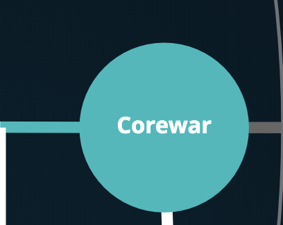

#42-Cursus
- corewar is the last project of the algo branch of the cursus 42
- corewar is a project between 3 or 4 student. I decided to make this project with kgrojea and ocrossi (2 students of 42 school)

# 42-corewar
This project involves creating a virtual arena, and having simplistic-language programs fight each other. You will thus get acquainted with VM conception (with instructions it recognizes, registers, etc) and compilation problems of an assembly language in bytecode. In bonus, the pleasure to have your champions fight in the arena.

For more information please read the subject int the folder ressources/subject
For	more information you can also read the wikipedia page (https://en.wikipedia.org/wiki/Core_War Or https://fr.wikipedia.org/wiki/Core_War)

# Compiling and running
run the command `make` at the root of the repo then, 2 programs appears (asm in the folder asm and corewar in the folder corewar)
- the asm is there for turned `champions.s` into `champions.cor`. champions.s is write in assembly language like and champion.cor is write in binary.
- the corewar is a program who takes max 4 `champions.cor` in input and execute his code into the vm. Then the battle begin in round by round.

## execution exemple

# asm output

# corewar output

# corewar graphic

# script

